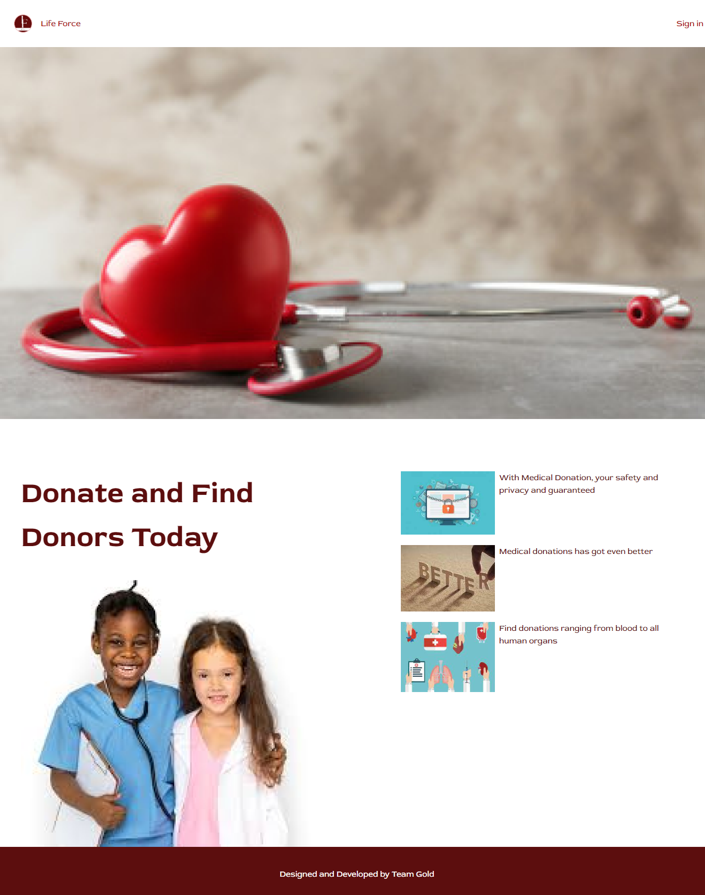

# LIFE FORCE APP
This is a medical application which allows registered users (patients) to find and book medical items donors nearest to them. Key features: User will be able to Request/Donate items, Book appointment, View all available donations/requests, Authenticate user, Pairing/suggestion of Donor and/or receiver by location (Location name or Zip code), FAQ section.
 
- This app is a front-end side of the final Blood Bank project. You can find the back-end app [here](https://github.com/Gahdloot/life-giver).
 
Project Repo:
[View Here](https://github.com/KingsleyIbe/medicaldonationapp)
 
- ## [Live Demo](https://life-force.vercel.app)
- ## [Live video Link](https://youtu.be/H4iXYVPgqGg)
- ## [Slide presentation](https://docs.google.com/presentation/d/1uS9XvNW4KAFECinIYzUuFNQ0QLGKMIq0fm2FHvU7Stg/edit?usp=sharing)
# Demo Account
 [Figma Prototype]( https://www.figma.com/proto/Ua7JZThSKzLuAVrZUxMk8e/Donation?node-id=29%3A136&scaling=scale-down&page-id=0%3A1&starting-point-node-id=29%3A136)

#### Life Force App Screenshots

<table>
  <tr>
    <td>Home Page</td>
     <td>Sign up/Login page (auth0)</td>
     <td>KYC verification page</td>
     <td>User dashboard</td>
  </tr>
  <tr>
    <td></td>
    <td></td>
    <td></td>
    <td></td>
  </tr>
 </table>

# Built with
 - React
 - Redux
 - React Router DOM
 - API (identitypass)
 - Tailwind css
 - Django
 - Auth0
## The learning objective of this project are
 
- Create-react-app (frontend app)
- Connect react frontend app to Django backend
- Use API endpoint to get data
- Fetch data from the API
- Verify user Virtual NIN using Identitypass API
 
## Getting Started
 
To get a local copy up and running follow these simple steps.
 
### Prerequisites
 
- [React](https://reactjs.org/tutorial/tutorial.html#prerequisites)
 
### Setup
 
- ```git clone https://github.com/KingsleyIbe/medicaldonationapp.git``
 
- ```cd medicaldonationapp```
 
### Running The App Locally
 
- Run `npm install`
- Run `npm start`

### Backend Project
- [Project Repo](https://github.com/Gahdloot/life-giver)
- [Backend Application Endpoint](https://live-giver.heroku)

# Authors
 
👤 **Kingsley Ibe**
 
- [Github](https://github.com/KingsleyIbe)
- [Twitter](https://twitter.com/ibekingsley2)
- [LinkedIn](https://www.linkedin.com/in/kingsley-ibe/)
 
 
 👤 Michael David**
 
- [github](https://github.com/Gahdloot)
- [Twitter](https://twitter.com/David_Gahd)
- [linkedin](https://www.linkedin.com/in/michael-david-oyenuga)
 
👤 Josephine Bonka
 
- [github](https://github.com/josephineEng)
- [Twitter](https://twitter.com/josephineeng2)
- [linkedin](www.linkedin.com/in/josephine-bonka-250263207)

👤 Adio Usman
 
- [Github](https://github.com/KingsleyIbe)
- [Twitter](https://twitter.com/ibekingsley2)
- [LinkedIn](https://www.linkedin.com/in/kingsley-ibe/)

 
 🔭 Future Features
We intend to implement the following feature in subsequent versions.

 [Register organisation]
 [Tag Expired transactions as expired]
 [Motivation drive: Implementation of Levels, cadar, points, coupon or gift card reward]

## 🤝 Contributing
 
Contributions, issues, and feature requests are welcome!
 
Feel free to check the [issues page](https://github.com/KingsleyIbe/medicaldonationapp/issues).
 
## Show your support
 
Give a ⭐️ if you like this project!
 
## Acknowledgments
 
- Hats off to [Prembly](https://www.prembly.com/). ✨
- [myidentitypass](https://myidentitypass.com/)for giving us this opportunity to their API feature
- The amazing mentor for making us improve every day 👍

❓ FAQ
We glad to answer some of your questions here:

- What is Life Force?
- How does the blood donation process work?
- Why is Life Force special?
- What are the risks involved in Life Force?
- Who can donate an Item?
- How do i trade or invest in Life Force?
- How often can I donate/request an item?
- Why does Life Force require personal questions to give or receive an item?
- Can I bring guests or children with me to my donation appointment?
- How does Life Force Safe Guard my Data?
- What should I do after donating an Item?

[Find answers here](https://life-force.vercel.app/faq)

## 📝 License
 
This project is [MIT](./LICENCE) licensed.
* ...
 